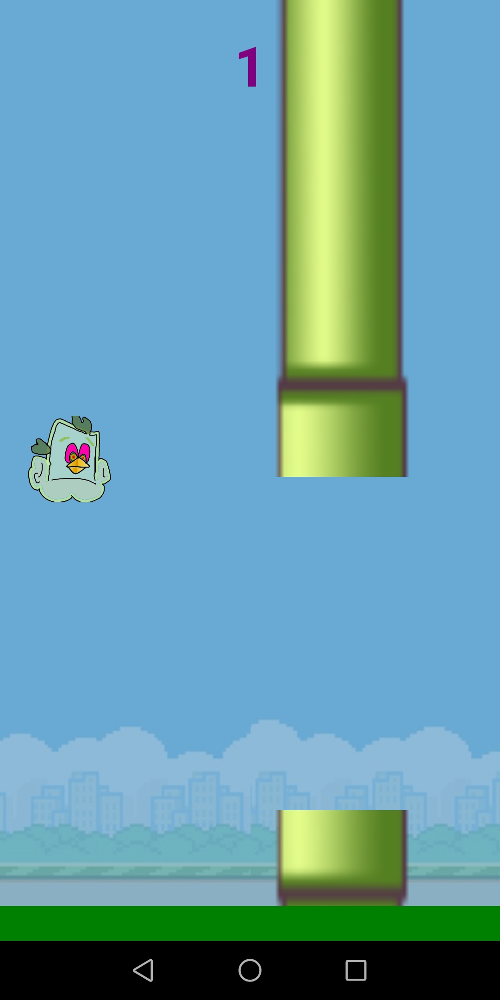

# Acid Bird - Revenge of the Hoffmans

If it wasn't for the fact that the Bird in my game is clearly under the influence of L.S.D this would just be a blatant, rudely executed copy of Flappy Bird.

This little game engine was created while learning react native. The main goal, besides gaining some much needed experience with React Native, was to have a basic never ending level with the score being displayed.

My "twist", if you can it call that, on the already much better and established game was the precence of halicinogenics that hopefully will take you on a journey of self discovery from which you will be reborn a new being.

## Author

- [@David Guerra](https://www.github.com/davidguerra27)

## Screenshots

## References&Thanks

- [@thepedrov](https://www.github.com/thepedrov) - a massive help setting up the Android Studio AVD.
- [@SimCoder](https://www.youtube.com/@SimpleCoder) - the always reliable [Youtube](https://www.youtube.com) Tutorials.
